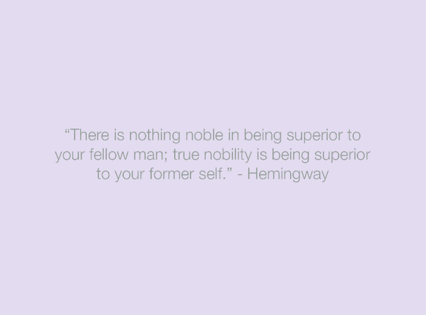

# Quotes
Quartz Composer Patch, fetches reddit's top quotes of the day, and shows them on the screen with slowly oscillating colors.
Suitable for OS X screen saver, if you would like to achieve such a thing, you can eg. run the following command:
```curl -o /Users/$(whoami)/Library/Screen\ Savers/quotes.qtz https://raw.githubusercontent.com/rikemonni/quotes/master/quotes.qtz```


